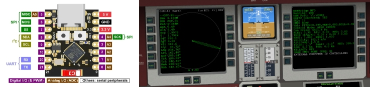
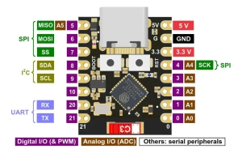
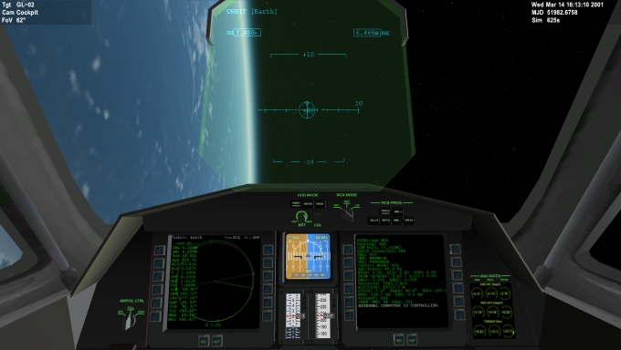

# ESPBridge MFD for Orbiter 2024

## Project Overview

**ESPBridge MFD for Orbiter 2024** is an advanced, open-source control interface designed to bridge the Orbiter Space Flight Simulator with external microcontroller hardware. This project establishes a deterministic, closed-loop command system, enabling the external execution of complex flight guidance logic for the dedicated target vessel: the **DeltaGlider GL-02**. The system offloads critical ascent and orbital maneuvering calculations to a dedicated external processor for enhanced realism and modularity.

---

## Architectural and Communication Protocol

The control system is based on a decoupled, two-part architecture connected via a standard serial communication link (e.g., USB-to-UART).

### 1. Orbiter Simulation Module (`ESPBridgeMFD.dll`)

* **Platform:** Orbiter 2024 Simulator.
* **Role:** Acts as the low-level data extraction and command injection layer.
* **Process:** The DLL monitors the target vessel's state and serializes critical flight data—including **Altitude**, **Velocity**, **Attitude** (Pitch, Bank, Heading), and **Orbital Elements** (Apoapsis, Periapsis)—into structured, high-frequency **Telemetry Packets** (`TLM=...`) transmitted out via the configured serial (COM) port. Simultaneously, it parses incoming **Command Packets** (`CMD=...`) and translates them directly into simulation control inputs (e.g., setting main engine thrust, control surface deflection, or gear state).

### 2. External Flight Guidance Controller (`esp32c3.bin`)

* **Platform:** **ESP32-C3** Microcontroller.
* **Role:** Executes the high-level Finite State Machine (FSM) guidance program.
* **Process:** The firmware continuously processes the received telemetry to update its internal state. It then calculates and transmits precise control commands back to the simulator to execute programmed maneuvers, such as automated thrust vectoring and attitude control, using a proportional-integral-derivative (PID) control scheme.

---

## Flight Guidance Logic: Automated Ascent Profile

The firmware implements a sophisticated, multi-stage ascent program optimized for the GL-02 DeltaGlider's efficient flight envelope. The control logic initiates immediately upon receiving the first valid telemetry packet following the MFD's **STA** command.

### 1. Initiation and Takeoff (`PRG_ROTATE_CLIMB`)
* **Objective:** Clear the runway and establish initial vertical velocity.
* **Actions:**
    * Full main engine throttle commanded (`MAIN=1.0`).
    * Vessel rotation commanded to a **15-degree pitch** attitude.
    * Landing gear retracted automatically at **100 meters** altitude.
* **Transition:** Crosses **500 meters** altitude.

### 2. High-Angle Ascent and Heading Capture (`PRG_HIGH_PITCH_CLIMB`)
* **Objective:** Rapidly penetrate the dense atmosphere while steering toward the target azimuth.
* **Actions:**
    * Fixed attitude hold at **40 degrees pitch** ($0.6981 \text{ rad}$).
    * Active bank maneuvers applied to capture the target heading (approx. $138.0^\circ$).
* **Transition (OR Logic):** State terminates when **20,000 meters altitude** is achieved **OR** the vessel heading is within $\pm 1.0^\circ$ of the target heading.

### 3. Gravity Turn and Acceleration (`PRG_ACCELERATE`)
* **Objective:** Build necessary horizontal velocity and achieve orbital Apoapsis target.
* **Actions:**
    * Pitch commanded is reduced to **$15^\circ$** ($0.2618 \text{ rad}$), then further to **$10^\circ$** ($0.1745 \text{ rad}$) above 40 km.
    * Aileron trim actively managed to compensate for aerodynamic forces.
* **MECO (Main Engine Cut-Off):** Engines are shut down when the predicted Apoapsis reaches approximately **330 km**.

### 4. Coast and Orbital Preparation (`PRG_PREPARE_HOLD`)
* **Objective:** Orient the vessel and wait for the precise circularization burn window.
* **Actions:**
    * `NAVMODE PROGRADE` activated (above 80 km) for stable orientation.
    * Monitors orbital state until the Apoapsis prediction stabilizes and the vessel is physically near Apoapsis (within 500m).

### 5. Circularization Burn (`PRG_ALTITUDE_HOLD`)
* **Objective:** Raise the Periapsis to establish a stable orbit.
* **Actions:**
    * Main engines re-ignited at Apoapsis.
    * Engines cut when the Periapsis reaches the dynamic target altitude (calculated as Apoapsis minus 60 km).

### 6. Program Complete (`PRG_COMPLETE`)
* **Actions:** Thrust commanded to zero, rotational thrusters commanded to **KILLROT**, and all control surfaces neutralized.

---

## Prerequisites and Deployment

### Hardware Requirements
* **Microcontroller:** **ESP32-C3**.
* **Connection:** USB Data Cable (Simulating a Serial COM Port).
    * ***Caution:*** *The user is solely responsible for any damage, "bricking," or operational issues resulting from flashing firmware onto a microcontroller device.*

### Software Requirements
* **Simulator:** **Orbiter Space Flight Simulator 2024**.
* **Target Vessel:** **DeltaGlider GL-02** (Must be the active vessel).

### Deployment Instructions

1.  **Orbiter Module Installation:**
    * Download `ESPBridgeMFD.dll` from the [Releases](https://github.com/asasoft/ESPBridge/releases) tab.
    * Copy the file to your Orbiter installation directory: `[Orbiter Root]\Modules\Plugin\`.
    * Activate the `ESPBridge MFD` module in the Orbiter Launchpad **Modules** tab.

2.  **Firmware Flashing:**
    * Download the binary file `esp32c3.bin` from the [Releases](https://github.com/asasoft/ESPBridge/releases) tab.
    * Connect your ESP32-C3 to the PC via USB.
    * Flash the binary to the device using a compatible tool (e.g., `esptool.py` or the Arduino IDE).

3.  **Launch Scenario:**
    * Start the Orbiter Launchpad.
    * Select the scenario located under: **LUA\DG Ready to takeoff**.
    * Press **Launch**.

4.  **Operation:**
    * In the cockpit, open an MFD display and select the **ESPBridge** mode.
    * Verify the displayed COM port status is **CONNECTED**.
    * Press the **STA** (Start) button to initiate the flight guidance program.
    * Press the **STO** (Stop) button for immediate emergency shutdown and state reset.

---

## Disclaimer and Acknowledgment

This project is of a highly **experimental and proof-of-concept** nature. The guidance parameters are rigid and optimized for specific initial conditions. The software is provided without any warranty regarding stability, performance, or suitability for any particular purpose.

The rapid development, complex state-management logic, and detailed tuning of the closed-loop control algorithms were significantly accelerated and verified through the utilization of a Large Language Model (LLM). This acknowledgment underscores the collaborative nature of modern systems engineering.

## License

This project is released under the **GNU General Public License v3.0 (GPLv3)**.
